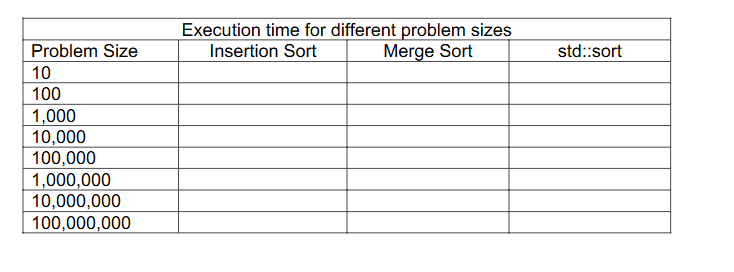

Spring 2026 – CS 201 Data Structures and Algorithms

Homework-0

Page 1 of 2

Maximum points: 100. Individual Work Only.

Due Date: January 28, 2026, by 11:59 PM.

Objectives

• Implement insertion sort and merge sort in C++ using iterators.

• Compare the performance of insertion sort and merge sort.

• Compare the performance of insertion sort and merge sort with the sort operation

provided by the C++ algorithms library.

Problem Description

1. Implement insertion sort and merge sort using the following function definitions:

template< class RandomIt >

constexpr void insertionsort ( RandomIt first, RandomIt last )

template< class RandomIt >

constexpr void mergesort ( RandomIt first, RandomIt last, RandomIt tempstart )

where [first, last) is the range of the elements to be sorted and tempstart is the

iterator to the beginning of the temporary memory (in case of merge sort).

2. Use the drive program (functest.cpp) provided to test your implementation of

insertion sort and merge sort using iterators and make sure that your program sorts

the data correctly with different types of containers and data types.

3. Execute your program for different problem sizes using insertion sort, merge sort,

and the sort operation provided by the C++ algorithms library and complete the

table below. You can use the driver program (perftest.cpp) provided to compute

the execution time for different problem sizes. If you execute the driver program as

is, it will display the time take by the std::sort method, replace the std::sort with

your insertion sort and merge sort methods to compute the time taken and

complete the table below.

Spring 2026 – CS 201 Data Structures and Algorithms

Homework-0

Page 2 of 2

4. Based on the execution time in the table above, answer the following questions:

a. For each of the three sort methods, what pattern do you observe in the

execution time as the problem size is increased (in other words, if you look

at each column in the table above, do you see any patterns in execution

time as related to the problem size)? Did you expect to see this pattern? If

so, why? If not, then what did you expect to see?

b. How does the execution time of insertion sort compare with execution time

of merge sort for different problem sizes? Explain the difference in

execution time.

c. How does the performance of your insertion sort and merge sort

implementations compare with the performance of the std:sort? Explain

any similarities or differences you observe.

Program Documentation and Testing

1. Use appropriate variables names and indentation in your source code.
2. Include meaningful comments to indicate various operations performed by the

program.

3. Programs must include the following header information within comments:

/*

Name:

Email:

Course Section: Spring 2026 CS 201 – 001/002

Homework #:

To Compile: <include instructions to compile the program>

To Run: <include instructions to run the program>

*/

Submission

Upload only the source files (.h or .cpp or .cc files) and include the table and answer to

the questions above in a separate document (Microsoft Word or PDF file) and upload it

to Blackboard in the assignment submission section for this homework. Please note that

you must upload only two source files, one for each sort, and not the provided driver

programs. Do not upload zip or tar files to Blackboard. Upload the individual source files

and a Word or PDF file instead.

Grading Rubrics

The following grading policy will be used for grading this homework:

Description Points

1. Correct implementation of insertion sort using iterators 40
2. Correct implementation of merge sort using iterators 40
3. Execution of all three versions and completing the table 10
4. Answer to short answer questions 10

NOTE: A correct implementation must use the provided function definitions and iterators

to implement the algorithms.