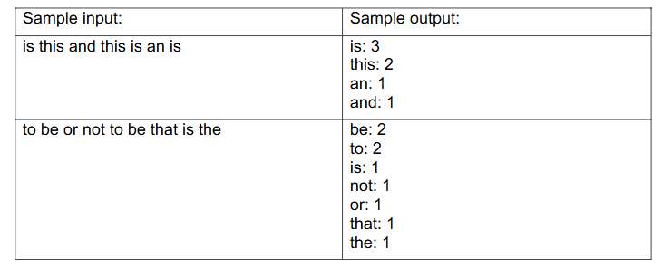
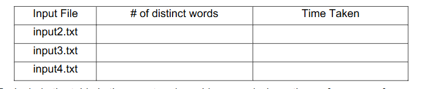

Spring 2026 – CS 201 Data Structures and Algorithms

Homework-1

Page 1 of 2

Maximum points: 100. Individual Work Only.

Due Date: February 18, 2026, by 11:59 PM.

Problem Description

Design an efficient C++ program that reads text from an input file that is specified as a

command-line argument, splits it into separate words, determines the number of times

each word appears in the input, and prints the words and the number of times it appears

ordered by the count (i.e., word with the highest count appears first). If the word counts

are equal then the words are printed in the alphabetic order.

Program Requirements:

1. A sample program to read the text and parse it into separate words is provided in

Blackboard. This program uses std::vector to store and print the separate words.

You can use this program as a starting point for your program and use any other

data structure that you may like to solve this problem.

2. The program must have a worst-case time complexity of O(N log N) where N is the

total number of words being counted.

3. You are free to use any of the C++ standard library data structures and functions

to implement your program as long as the overall complexity of the program is O(N

log N) in the worst case.

4. Test your program for the different input files provided in Blackboard and complete

the table below.

5. Include the table in the report and provide an analysis on the performance of your

implementation for different input files.

Spring 2026 – CS 201 Data Structures and Algorithms

Homework-1

Page 2 of 2

6. Provide a justification for using a particular data structure(s) along with a short

description of your algorithm and explain how the worst-case complexity of the

algorithm is O(N log N) in the report.

Program Documentation and Testing

1. Use appropriate variables names and indentation in your source code.
2. Include meaningful comments to indicate various operations performed by the

program.

3. Programs must include the following header information within comments:

/*

Name:

Email:

Course Section: Spring 2026 CS 201 – 001/002

Homework #:

To Compile: <include instructions to compile the program>

To Run: <include instructions to run the program>

*/

Submission

Upload only the source files (.h or .cpp or .cc files) and the report (Word or PDF file) to

Blackboard in the assignment submission section for this homework. Do not upload zip/tar

files to Blackboard, upload individual source files (no object files or executables) and the

Word or PDF file for the report.

Grading Rubrics

The program will be evaluated not only on correctness using the provided sample input,

but also on its worst-case time complexity. Solutions that run in O(N2) time will receive 0

credit, even if they produce correct output.

The following rubrics will be used for grading:

Description Points

1. Correct implementation of the solution 70
2. Implementation with worst-case complexity of O(N log N) 15
3. Report with table, justification, and algorithm overview 15